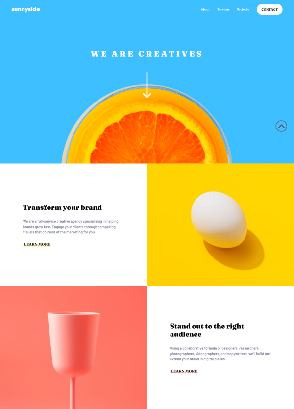
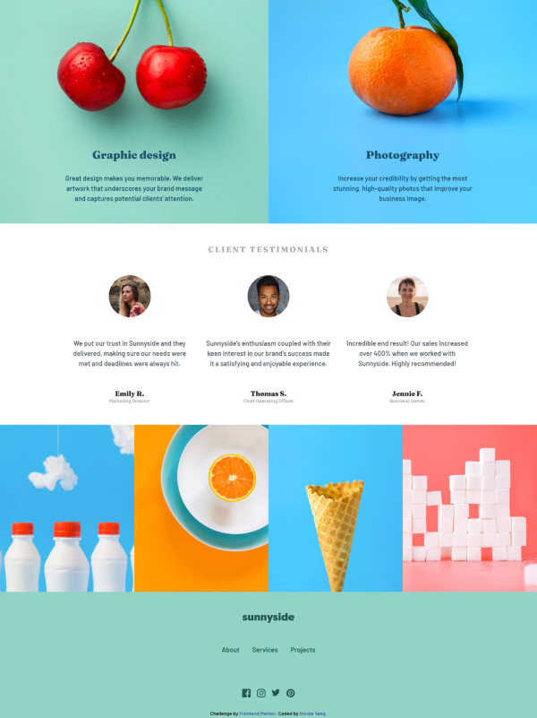

# Frontend Mentor - Sunnyside agency landing page solution

This is a solution to the [Sunnyside agency landing page challenge on Frontend Mentor](https://www.frontendmentor.io/challenges/sunnyside-agency-landing-page-7yVs3B6ef). Frontend Mentor challenges help you improve your coding skills by building realistic projects.

## Table of contents

- [Overview](#overview)
  - [The challenge](#the-challenge)
  - [Screenshot](#screenshot)
  - [Links](#links)
- [My process](#my-process)
  - [Built with](#built-with)
  - [Useful resources](#useful-resources)
- [Author](#author)

## Overview

### The challenge

Users should be able to:

- View the optimal layout for the site depending on their device's screen size
- See hover states for all interactive elements on the page

### Screenshot

    <h5>Desktop: </h5>
	

		
		
	

    <h5>Mobile: </h5>
	

		
		
		
	

### Links

- Solution URL: [https://www.frontendmentor.io/solutions/responsive-landing-page-using-css-grid-and-flexbox-au9yt38L1T](https://www.frontendmentor.io/solutions/responsive-landing-page-using-css-grid-and-flexbox-au9yt38L1T)
- Live Site URL: [https://nicoleyry.github.io/sunnyside-agency-landing-page/](https://nicoleyry.github.io/sunnyside-agency-landing-page/)

## My process

### Built with

- Semantic HTML5 markup
- CSS custom properties
- Flexbox
- CSS Grid
- Mobile-first workflow

### Useful resources

- [Styling Underlines on the Web](https://css-tricks.com/styling-underlines-web/)
- [The Shapes of CSS](https://css-tricks.com/the-shapes-of-css/)

## Author

- Website - [Nicole Yang](https://www.nicoleyry.com/)
- Frontend Mentor - [@nicoleyry](https://www.frontendmentor.io/profile/nicoleyry)
- Twitter - [@nicoleyry](https://twitter.com/nicoleyry)
